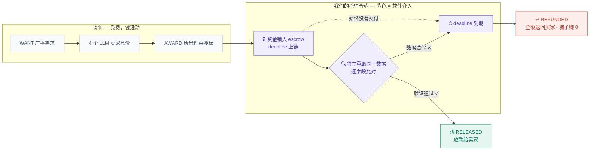

# 「Follow the money」资金流标签页 — 设计交接文档（白底版 v3）

交接对象：美术/视觉设计
配套文件：同目录 **`flow-tab-template.html`**（双击浏览器即可预览的 1:1 交互模板，改它即可）
在线参考稿：https://claude.ai/code/artifact/c9940c59-3d8e-401c-981a-2cc93941dcd8
⏰ **截止：2026-07-04 22:59 前需合入产品**（黑客松提交截止），请尽早回传。

> 相比上一版（深色流水线），本版按新方向重做：**白底 + 柔和亮色**；叙事从"7 站流水线"
> 改为"**跟着钱走**"——钱只会待在三个地方，紫色标出我们软件的介入点。

---

## 1. 一句话论点（设计必须服务它）

> **钱只有三个居所：买家钱包、我们的托管合约、卖家钱包。**
> 谈判阶段分文不动；钱一旦移动就在我们合约手里——锁定、独立验货、到期自动可退。
> **没有丢钱的路径。**

观众是黑客松评委：第一眼要读懂 **紫 = 我们的软件在场，绿 = 钱到卖家，珊瑚红 = 钱退回买家，灰虚线 = 还没花钱**。

## 2. 页面结构（从上到下）

```
┌ 产品外壳（标题 + 标签栏「Live market / Follow the money」）
├ 主面板（白卡片，大圆角软阴影）
│  ├ 标题句 + 三行导语（紫色高亮"our escrow contract / our software"）
│  ├ 场景按钮 ×3（✓ 诚实交付 / ✕ 中标后跑路 / △ 交付假数据）
│  ├ 资金画布（1010×388，横向滚动容器内）
│  │   ├ 谈判条（左上，灰虚线框）：WANT → BID×4 → AWARD 三枚协议 chip
│  │   ├ 三张钱包卡：🧍 买家（左）｜🏛 托管金库=我们的合约（中，紫标签）｜🤝 卖家（右）
│  │   │    · 每张卡带实时余额（等宽数字，动画中会变）
│  │   │    · 金库卡内三枚紫色介入徽章：🔒 锁定 / 🔍 独立验货 / ⏱ deadline→refund()
│  │   ├ SVG 资金路径 ×3：存入（买→库）/ 放款（库→卖）/ 退款（库→买，下方 U 形回环）
│  │   ├ 金色硬币 ◉（沿路径飞行的资金本体，金额随场景变）
│  │   ├ 交付飞标 📦（库↔卖之间：DELIVERED ✓ / …silence / forged payload）
│  │   └ 结果牌 ×2：绿「Seller paid」（卖家下方）/ 红「Money returned」（买家下方），带真实 Explorer 链接
│  ├ 回执窗（等宽字体，逐行打印协议消息，动词按语义着色）
│  ├ 图例 ×4（灰=谈判免费 / 紫=我们持有并校验 / 绿=放款 / 红=退款）
│  └ 点题句
```

## 3. 三个场景的剧本（模板里可点击体验）

| 场景 | 资金轨迹 | 关键帧 |
|---|---|---|
| ✓ 诚实交付 | 买 → 库 → 卖 | 锁定✓ → 📦DELIVERED✓ → 🔍match✓ → 硬币右行 → 卖家卡绿光 + RELEASED 链接 |
| ✕ 跑路 | 买 → 库 → ↩买 | 锁定✓ → 📦…silence → ⏱45s passed → 硬币走下方 U 形回环 → 买家卡红光 + REFUNDED 链接 |
| △ 假数据 | 买 → 库 → ↩买 | 锁定✓ → 📦forged → 🔍mismatch✕ → ⏱到期 → 同退款回环 |

节奏：每步 850ms，硬币飞行 1100~1300ms；`prefers-reduced-motion` 下动画全部退化为瞬时状态（模板已处理，**这个分支不能删**）。

## 4. 设计 Tokens（你的工作面，全部在模板 `<style>` 顶部）

| 组 | Token | 当前值 | 语义 |
|---|---|---|---|
| 底色 | `--paper / --card / --ink / --dim-solid / --line` | #f6f8fb / #fff / #232b36 / #687382 / #e3e8f0 | 白底柔亮基调 |
| 薄荷绿 | `--mint / --mint-tint` | #17a377 / #e5f6f0 | **钱到卖家** |
| 珊瑚红 | `--coral / --coral-tint` | #e2604e / #fdeeeb | **钱退回买家** |
| 琥珀 | `--gold / --gold-tint` | #d0940f / #faf3e2 | 报价/交付中间态、硬币本体 |
| 天蓝 | `--sky / --sky-tint` | #3e78e8 / #eaf1fd | 链接、进行中 |
| 紫 | `--violet / --violet-tint` | #7a63e6 / #f0edfc | **我们软件的介入点**（金库标签+三徽章+导语高亮） |
| 阴影 | `--shadow / --shadow-soft` | 见模板 | 软投影，无辉光 |
| 字体 | `--sans / --mono` | 系统无衬线 / 系统等宽 | 叙事用 sans，协议/金额必须 mono |

## 5. 铁律（不可妥协）

1. **语义色四分法不可破坏**：紫（我们介入）/ 绿（钱到卖家）/ 红（钱退买家）/ 灰虚线（钱没动）必须一眼可分；色相可微调，含义不可互换、不可合并。硬币保持金色系（它是"钱本体"，不属于四色）。
2. **文案与数据一字不改**：英文文案、协议消息、两个 Explorer 链接（真实 devnet 交易）是产品事实；要改措辞请批注。
3. **白底浅色主题**（本版新基调）；对比度请保证 WCAG AA（小字 ≥4.5:1）。
4. **回执窗、金额、协议 chip 保持等宽字体**；标题导语可自由换 sans（不可引入联网字体，需内嵌 base64 并注明）。
5. **HTML/JS 不改**；卡片坐标可调但需批注（SVG 路径锚点要同步改，由我们来做）。
6. **可访问性**：`:focus-visible` 焦点圈、reduced-motion 降级，两处不能删。

## 6. 自由发挥区

- 三张钱包卡与金库的造型层次（金库是主角，紫标签/徽章的质感）
- 硬币的形态（当前是金色胶囊 ◉ + 金额；可以更像一枚币）
- 三条资金路径的线型（虚线间距、流向箭头、点亮时的过渡）
- 结果牌落地的一刻（红色「Money returned — cheater earned 0」是全页情绪高点）
- 谈判条、回执窗的轻终端质感（别抢主画布）

## 7. 交付方式

首选：改模板 TOKENS（+ 有标注的纯视觉 CSS 调整），回传整个 HTML——我们 1:1 移植进 React。
也接受：Figma + token 值清单（hex/px/ms）。回传当天合入并跑测试。

## 8. 附：Mermaid 版（用于 GitHub README / deck，非交互场合）

GitHub 原生渲染以下代码块，色值与本设计一致：



## 9. 背景速览（选读）

产品是「Accountable Agent Market」：AI agent 用 Solana 链上托管互相买卖数据的真实市场。
一轮交易：买家广播需求 → 4 个 LLM 卖家人设竞价（seller-rogue 是内置反派）→ 买家给理由授标 →
钱锁进托管合约 → 卖家交付真实体育赔率数据 → 买家**独立重新拉取同一数据比对验证** →
通过才放款；跑路或假数据 → deadline 一到买家单方面签名全额收回。页面上两个 Explorer
链接分别是真实的放款交易和真实的退款交易。
